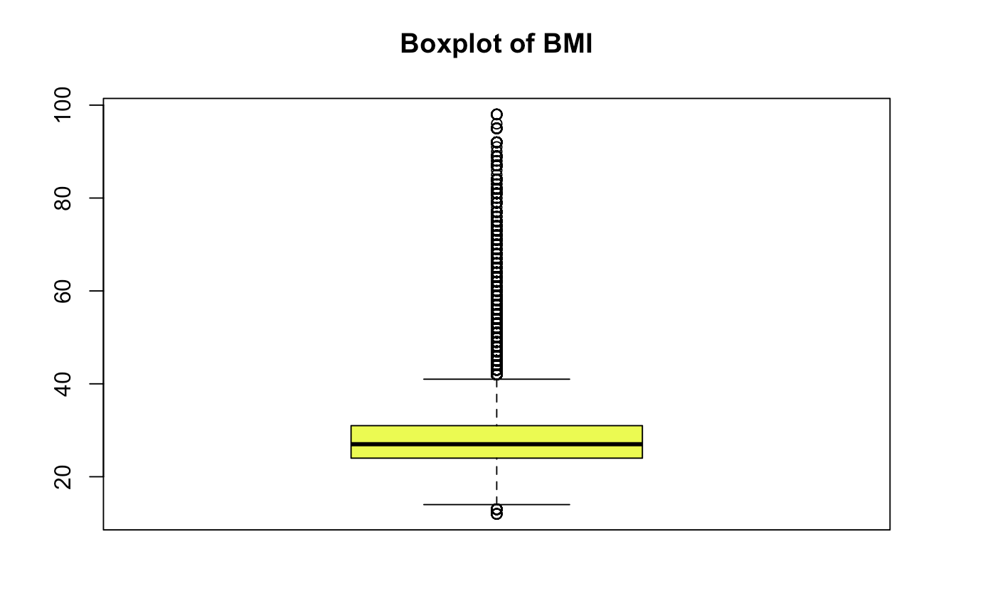
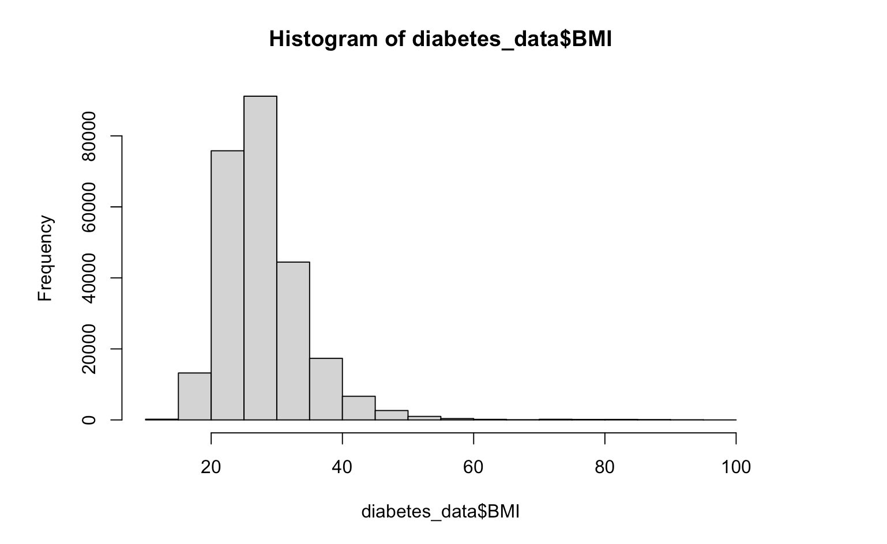
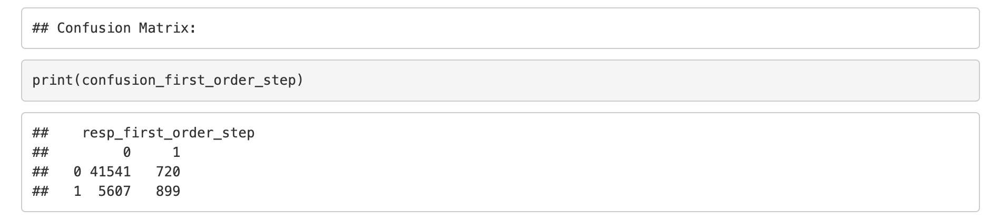
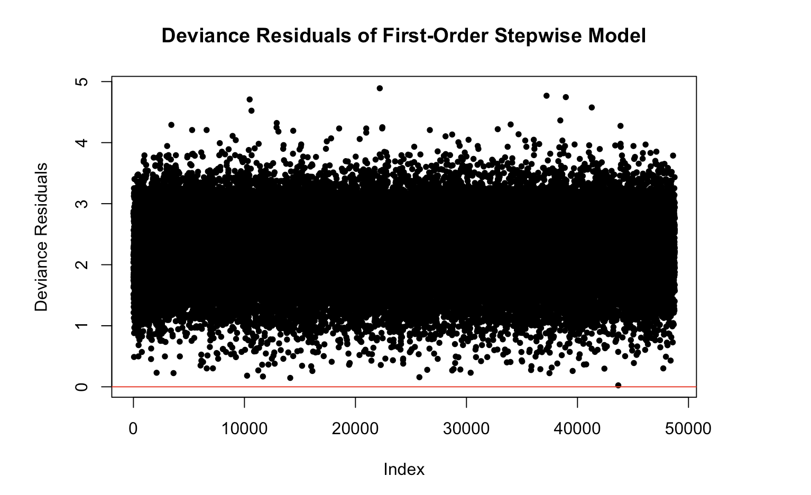
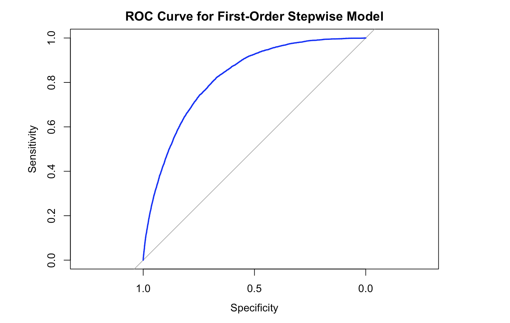

# Predicting Type II Diabetes Using Logistic Regression on BRFSS 2015 Data
#### By Rahul Singh, – Project for my Master's course: DSC 423 (Data Analysis and Regression)

## Introduction and Motivation
Type II diabetes is a chronic condition marked by elevated blood sugar, insulin resistance, and impaired insulin production. It can lead to serious complications such as cardiovascular disease, kidney failure, vision loss, and neuropathy. According to the American Diabetes Association, its global prevalence continues to rise, posing significant challenges for public health systems. Early detection and management are vital to reduce long-term impacts.
Although largely preventable through lifestyle changes, the incidence of Type II diabetes remains high. This underscores the need for data-driven approaches to identify key risk factors. By analyzing real-world health survey data, we aim to determine which demographic, health, and lifestyle variables are most predictive of diabetes. These insights can support early intervention strategies, inform public health efforts, and ultimately improve patient outcomes by helping identify high-risk individuals.

## Objectives
This project addresses two key research questions:
- **Q1: Significant Risk Factors** – Which independent variables significantly impact the likelihood of developing Type II diabetes? For example, how strongly do factors like BMI, blood pressure, or physical inactivity influence diabetes risk?
- **Q2: Predictive Power** – Which combination of variables best classifies individuals as diabetic or non-diabetic? The goal is to build an accurate, interpretable model using the most relevant predictors.  
In addition to building predictive models, this project emphasizes reflection on the modeling process—considering challenges such as class imbalance and model complexity—and aims to extract meaningful, practical insights for future analysis.

## Dataset Description
This analysis uses data from the 2015 Behavioral Risk Factor Surveillance System (BRFSS), sourced via Kaggle (rated 100% for usability). The dataset contains 253,680 observations across 22 variables, with no missing values. Each row represents an individual respondent, capturing a mix of health, lifestyle, and demographic data alongside a binary outcome for diabetes.
- **Health Indicators:** High blood pressure (HighBP), high cholesterol (HighChol), recent cholesterol check (CholCheck), body mass index (BMI), history of heart disease or stroke, general health rating (GenHlth), and counts of poor mental or physical health days (MentHlth, PhysHlth).
- **Lifestyle Factors:** Smoking status (Smoker), heavy alcohol consumption (HvyAlcoholConsump), physical activity (PhysActivity), daily fruit and vegetable intake (Fruits, Veggies), and difficulty walking (DiffWalk).
- **Demographic Factors:** Age, Sex, education level, income level, and healthcare access (AnyHealthcare).
- **Target Variable:** Diabetes_binary (1 = has Type II diabetes, 0 = no diabetes). This is the outcome we aim to predict.  

The dataset’s size and variable diversity support robust modeling of diabetes risk. While cross-sectional and self-reported, the data are well-suited for predictive analysis.

## Data Preprocessing and Feature Engineering
The dataset had no missing or duplicate entries, allowing us to focus on preparing variables for logistic regression. Key preprocessing steps included:
- **Outlier Detection and Removal:** Continuous variables like BMI showed extreme values and right-skewed distributions. We applied the Interquartile Range (IQR) method to remove BMI values beyond [Q1 – 1.5 x IQR, Q3 + 1.5 x IQR], which reduced the impact of outliers and improved distribution symmetry.   

   

   
 
- **Grouping Skewed Count Variables:** MentHlth and PhysHlth were originally measured as number of poor health days (0–30), with strong skew toward zero. These were binned into Low (0–5), Moderate (6–16), and High (>16) categories. GenHlth (1–5 scale) was grouped into Good (“Excellent” and “Very Good”), Average (“Good”), and Poor (“Fair” and “Poor”) to simplify interpretation and reduce outlier influence.
- **Age Categorization:** Age was recoded from ordinal levels into three groups—Young (≤5), Middle-aged (6–9), and Older (>9)—to capture non-linear effects and aid model interpretability.
- **Education and Income Simplification:** Both were collapsed into Low, Medium, and High categories based on logical groupings, reducing model complexity while preserving socio-economic insights.   
Following these transformations, *we examined pairwise correlations and computed Variance Inflation Factors (VIF). Correlations were generally low, and all VIF values were close to 1, indicating minimal multicollinearity and supporting reliable coefficient estimates for logistic regression.*

## Modeling Approach

Given the binary nature of the outcome (diabetic vs. non-diabetic), we used logistic regression as our primary modeling method. It allowed us to assess the influence of predictors through interpretable odds ratios. We developed several models of increasing complexity:
- **Baseline Full Model:** This model included all preprocessed predictors (e.g., high blood pressure, BMI, physical activity, age group, income, education) to evaluate overall factor significance and establish a performance benchmark.
- **Stepwise Feature Selection:** Using a stepwise regression (based on Akaike’s Information Criterion), we derived a leaner model by removing predictors that didn’t meaningfully contribute to model fit. This approach improved interpretability while retaining similar performance, helping confirm the most influential variables.
- **First-Order Model:** Included all key features as main effects without polynomial or interaction terms. This served as a clean baseline to compare against more complex variants.
- **Second-Order Model:** Included squared terms for continuous predictors (e.g., BMI) to test for non-linear effects. We also initially tested some interactions. These additions provided only marginal performance gains.
- **Interaction Model:** Focused on selected pairwise interactions, particularly involving age (e.g., age × BMI, age × physical activity), to explore compounding risk effects. It included all main effects but excluded polynomial terms.   
All models were trained using R’s glm function, with training/test splits used to evaluate generalization. To complement these, we also explored regularized regression:   
- **LASSO and Ridge:** Implemented via glmnet, these models aimed to improve generalization and automate feature selection. However, LASSO aggressively zeroed out coefficients—even after tuning—likely due to lack of true sparsity. Ridge showed no performance benefit, likely because of low multicollinearity. As such, we did not include regularized models in the final analysis.

## Results and Model Performance

Across all logistic regression models, performance was highly consistent. Adding complexity—via stepwise selection, quadratic terms, or interactions—did not substantially improve predictive power. Below is a summary of each model’s test-set performance:
- **Full Logistic Regression (All Predictors):** Accuracy ≈ 87%; AUC = 0.8224; Sensitivity ≈ 14%. The model correctly classified most non-diabetics (e.g., ~41,525), but only a small portion of diabetics (~912). Specificity was very high, reflecting strong ability to avoid false positives.
- **Stepwise-Selected Model:** Maintained ~87% accuracy and AUC ≈ 0.822, with similar sensitivity (~13–14%). Simplified model retained key predictors and offered better interpretability without sacrificing performance.
- **First-Order Model (Main Effects Only):** Accuracy = 87.03%; AUC = 0.8216; Sensitivity ≈ 13.8%. Comparable to the full model, confirming that additional complexity wasn’t necessary for this dataset.
- **Second-Order Model (Quadratic Terms):** Accuracy = 87.0%; AUC = 0.8223; Sensitivity ≈ 13.8%. The small gain in AUC suggests limited benefit from non-linear terms, likely due to existing categorical groupings already capturing most non-linearity.
- **Interaction Model:** Accuracy = 87.13%; AUC = 0.8241—the highest among all models. However, sensitivity dropped to ~12.1%, suggesting slight overfitting and diminished ability to detect diabetic cases.
One consistent pattern across models was low sensitivity (~12–14%) despite high specificity. This reflects the class imbalance in the dataset, where diabetics represent only 6–8% of cases. As a result, models predicted most non-diabetic cases correctly but missed many diabetic individuals.   

   
 
High specificity and low sensitivity are typical in imbalanced health data. To improve diabetic case detection, future work might explore resampling methods or adjust the classification threshold (e.g., lowering the cutoff to increase sensitivity at the cost of some specificity). Techniques like SMOTE could also provide synthetic examples of minority class observations.
Model diagnostics confirmed the logistic regression assumptions were generally met. A deviance residuals plot showed residuals centered around zero, with no major patterns or influential outliers.

 
  
 
The ROC curve for the first-order model curved toward the top-left, consistent with its AUC.

  
 
ROC curves for other models were nearly identical, reinforcing that all models performed similarly.

## Key Predictors and Their Interpretation

<table style="width:100%; border-collapse: collapse;" border="1">
  <thead>
    <tr>
      <th>Rank</th>
      <th>Predictor</th>
      <th>Odds Ratio (OR)</th>
      <th>Direction</th>
      <th>p-value</th>
      <th>Interpretation</th>
    </tr>
  </thead>
  <tbody>
    <tr>
      <td>1</td>
      <td>High Blood Pressure</td>
      <td>≈ 2.07</td>
      <td>Positive</td>
      <td>&lt; 0.001</td>
      <td>Strongest predictor. Individuals with hypertension had double the odds of diabetes.</td>
    </tr>
    <tr>
      <td>2</td>
      <td>High Cholesterol</td>
      <td>≈ 1.69</td>
      <td>Positive</td>
      <td>&lt; 0.001</td>
      <td>Closely linked with diabetes, likely due to metabolic overlap.</td>
    </tr>
    <tr>
      <td>3</td>
      <td>General Health Status (Poor)</td>
      <td>≈ 1.59</td>
      <td>Positive</td>
      <td>&lt; 0.0001</td>
      <td>Self-rated poor health associated with 60% higher diabetes odds.</td>
    </tr>
    <tr>
      <td>4</td>
      <td>Age Group (Older)</td>
      <td>≈ 1.45</td>
      <td>Positive</td>
      <td>&lt; 0.0001</td>
      <td>Older adults had significantly higher odds of diabetes.</td>
    </tr>
    <tr>
      <td>5</td>
      <td>Income Level (Low vs High)</td>
      <td>≈ 1.33</td>
      <td>Positive</td>
      <td>&lt; 0.0001</td>
      <td>Lower income strongly correlated with higher diabetes risk.</td>
    </tr>
    <tr>
      <td>6</td>
      <td>Sex (Male vs Female)</td>
      <td>≈ 1.27</td>
      <td>Positive</td>
      <td>&lt; 0.0001</td>
      <td>Males had 27% greater odds of diabetes.</td>
    </tr>
    <tr>
      <td>7</td>
      <td>Education Level (Low vs High)</td>
      <td>≈ 1.27</td>
      <td>Positive</td>
      <td>--</td>
      <td>Lower education linked to higher diabetes risk, likely via health literacy.</td>
    </tr>
    <tr>
      <td>8</td>
      <td>Difficulty Walking</td>
      <td>≈ 1.14</td>
      <td>Positive</td>
      <td>&lt; 0.0001</td>
      <td>May reflect impact of neuropathy, obesity, or poor health.</td>
    </tr>
    <tr>
      <td>9</td>
      <td>Body Mass Index (BMI)</td>
      <td>≈ 1.09</td>
      <td>Positive</td>
      <td>&lt; 0.001</td>
      <td>Each unit increase in BMI raised odds of diabetes by 9%.</td>
    </tr>
    <tr>
      <td>10</td>
      <td>Physical Activity</td>
      <td>≈ 0.95</td>
      <td>Negative</td>
      <td>&lt; 0.01</td>
      <td>5% reduction in diabetes odds for physically active individuals.</td>
    </tr>
    <tr>
      <td>11</td>
      <td>Vegetable Intake</td>
      <td>≈ 0.95</td>
      <td>Negative</td>
      <td>≈ 0.01</td>
      <td>Slightly protective effect; small reduction in diabetes odds.</td>
    </tr>
    <tr>
      <td>12</td>
      <td>Heavy Alcohol Consumption</td>
      <td>≈ 0.45</td>
      <td>Negative</td>
      <td>&lt; 0.001</td>
      <td>Surprisingly associated with lower odds—likely confounded or spurious.</td>
    </tr>
    <tr>
      <td>13</td>
      <td>Age Group (Younger)</td>
      <td>≈ 0.42</td>
      <td>Negative</td>
      <td>&lt; 0.0001</td>
      <td>Younger adults had less than half the odds compared to middle-aged group.</td>
    </tr>
    <tr>
      <td>14</td>
      <td>Mental &amp; Physical Health Days</td>
      <td>--</td>
      <td>None</td>
      <td>NS</td>
      <td>Not statistically significant; influence may be captured elsewhere.</td>
    </tr>
  </tbody>
</table>

All the models we built largely converged on the same set of statistically significant predictors for Type II diabetes. The logistic coefficients and odds ratios revealed the following variables as most impactful (holding other factors constant):
- **High Blood Pressure (Hypertension):** A strong positive predictor (p < 0.001). Individuals with high BP had approximately twice the odds of diabetes (OR ≈ 2.07), consistent with its role in metabolic syndrome.
- **High Cholesterol:** Also significantly linked with diabetes (p < 0.001), increasing the odds by about 1.69 times (OR ≈ 1.69), likely reflecting shared lifestyle and metabolic risk factors.
- **Body Mass Index (BMI):** A one-unit BMI increase raised the odds of diabetes by roughly 9% (OR ≈ 1.09, p < 0.001). This quantifies the strong link between obesity and diabetes.
- **History of Heart Disease or Stroke:** Both were significant predictors (p < 0.0001), increasing diabetes odds by ~30–40%. This aligns with shared risk pathways and the tendency for comorbid conditions to be diagnosed together.
- **Physical Inactivity (PhysActivity):** Negatively associated with diabetes (p < 0.01). Those engaging in physical activity had a ~5% reduction in odds (OR ≈ 0.95), reinforcing the protective role of exercise.
- **Dietary Factors:** Regular vegetable intake slightly reduced diabetes odds (OR ≈ 0.95, p ≈ 0.01), while fruit intake was not significant—possibly due to collinearity or uniform consumption patterns.
- **Heavy Alcohol Consumption:** Surprisingly associated with lower diabetes odds (OR ≈ 0.45, p < 0.001). This likely reflects confounding effects, such as medical avoidance of alcohol by diabetics or selection bias, and not a causal relationship. This is a cautionary example of spurious associations in observational data.
- **Difficulty Walking (DiffWalk):** Strongly predictive (OR ≈ 1.14, p < 0.0001), likely reflecting the compounding influence of obesity, neuropathy, or general poor health on mobility and diabetes risk.
- **Sex:** Males had ~27% higher odds of diabetes than females (OR ≈ 1.27, p < 0.0001), aligning with epidemiological patterns.
- **Age Group:** Older adults had significantly higher odds (OR ≈ 1.45), while younger adults had less than half the odds (OR ≈ 0.42) compared to the middle-aged group (p < 0.0001). Age was one of the most potent predictors.
- **Education Level:** Lower education levels were associated with increased diabetes risk (Low vs High OR ≈ 1.27, Medium vs High OR ≈ 1.05). This suggests that health literacy and access to preventive care play key roles.
- **Income Level:** Similar to education, lower income predicted higher odds of diabetes (Low vs High OR ≈ 1.33, Medium vs High OR ≈ 1.21, p < 0.0001), reflecting socioeconomic health disparities.
- **General Health Status:** A powerful subjective predictor. Poor health self-ratings were associated with 60% higher odds of diabetes (OR ≈ 1.59), while excellent/very good health reduced odds by more than half (OR ≈ 0.44, p < 0.0001).
- **Mental and Physical Health Days:** Surprisingly, grouped counts of poor health days (MentHlth, PhysHlth) were not significant. Their influence may be already captured by general health and mobility variables, or they may reflect short-term fluctuations rather than chronic conditions.  

In summary, the most consistent predictors of Type II diabetes were: hypertension, high cholesterol, obesity, low physical activity, older age, male sex, low SES (education and income), mobility issues, and poor self-rated health. While most findings align with clinical literature, a few (like the alcohol effect) serve as critical reminders of the complexity and limitations of observational data. These insights reinforce diabetes as a multifactorial condition driven by interrelated biological, behavioral, and socioeconomic factors.

## Limitations and Lessons Learned

This project provided meaningful insights into the data science process and the challenges of predicting diabetes, but it also exposed areas for improvement. Reflecting on the process with more experience, we identify several limitations and key takeaways:
- **Class Imbalance and Sensitivity Trade-off:** A major challenge was the heavy class imbalance, with diabetic cases forming a small minority. All models had low sensitivity (~12–14%), meaning many diabetics were missed. This emphasized that in medical prediction tasks, recall often matters more than overall accuracy. We learned that adjusting thresholds or using resampling techniques like SMOTE or undersampling could have improved model recall. This was a key lesson: high accuracy can mask poor performance in detecting the critical class.
- **Model Complexity vs. Interpretability:** Increasing model complexity (adding interactions or polynomial terms) yielded minimal performance gains. Simpler models were equally effective and more interpretable. This validated the principle of starting with the simplest adequate model. Our use of meaningful categorical groupings captured non-linearities well, reducing the need for complex transformations.
- **Regularization Caution:** LASSO eliminated all predictors, and Ridge showed no gain. Initially surprising, this taught us that regularization is most useful in high-dimensional or multicollinear settings, neither of which applied here. It also highlighted the need for tuning regularization strength and ensuring data preparation (e.g., scaling) is appropriate. In this context, stepwise selection was more practical.
- **Data Limitations:** The BRFSS data is self-reported and cross-sectional, introducing possible biases (e.g., misreporting of health behaviors) and limiting causal inference. For example, the association between cholesterol checks and diabetes likely reflects confounding by age or healthcare usage rather than causality. This reinforced the importance of domain knowledge in interpreting statistical associations.
- **Threshold Selection and Metrics:** Using a 0.5 cutoff for classification was suboptimal. While our AUC (~0.82) indicated strong model discrimination, the default threshold contributed to low sensitivity. We learned that adjusting thresholds (e.g., lowering it to catch more diabetics) or examining precision-recall trade-offs is crucial, especially in healthcare applications.
- **Feature Engineering Wins and Misses:** Binning variables (age, income, education) improved interpretability and managed skew, but also introduced arbitrary cutoffs and potential information loss. For example, someone just inside the “Older” age bin may not differ much from someone just outside it. While these groupings worked for a classroom project, we learned that smoother, data-driven transformations (e.g., splines) could offer greater fidelity in future work.
- **Unanticipated Findings:** Some findings were unexpected – such as the negative association of heavy drinking with diabetes, and the non-significance of smoking. These required deeper investigation. We found that health datasets often reflect confounding factors or population-specific quirks. This experience taught us to question surprising results and not dismiss them outright, as they may reveal insights or data issues worth exploring.

## Conclusion:

This project offered not only a predictive model for Type II diabetes (AUC ~0.82), but also a valuable learning experience in handling real-world data and balancing performance with interpretability. While we confirmed known medical risk factors, we also learned to question surprising outputs and to critique our modeling choices. More than the final metrics, this project strengthened our ability to think statistically, communicate clearly, and reflect critically — skills that will shape our future work in data science.

